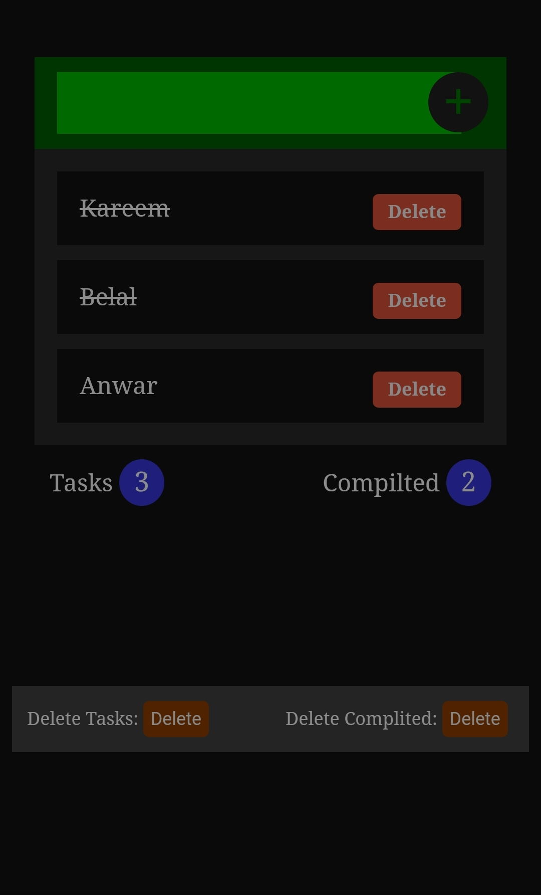
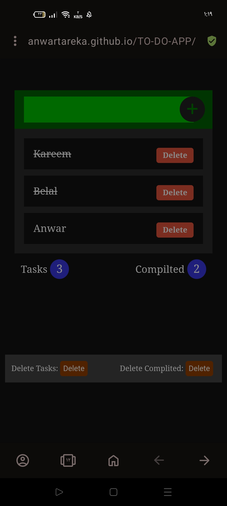
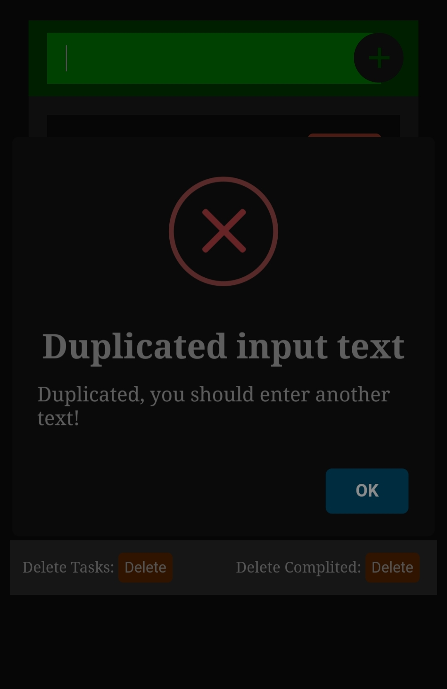
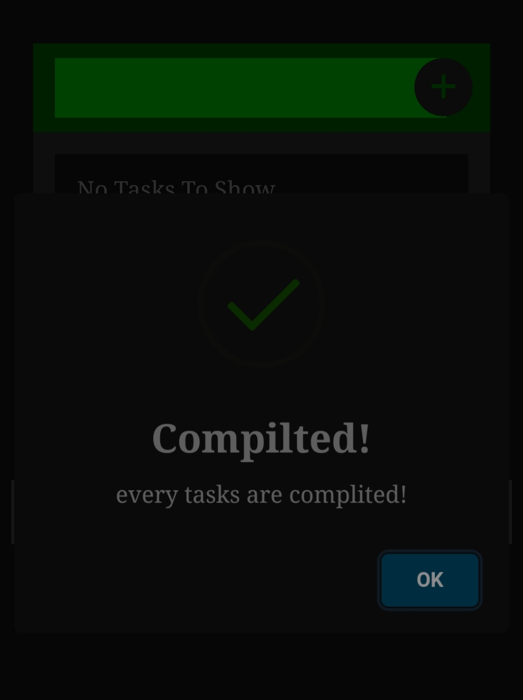
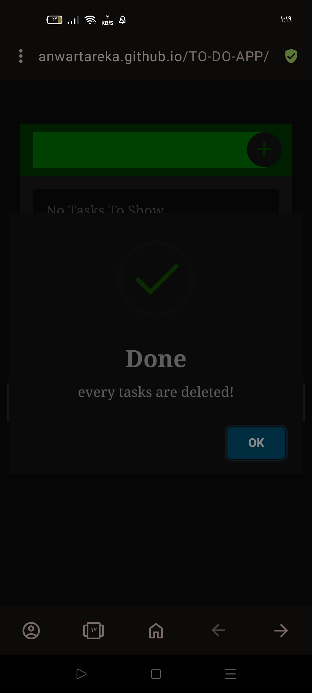

# TO-DO-APP
TO-DO-APPLICATION created by java script .
### Introduction:-
The storing informations is very important in our works
the TO-DO application can do it .
### Description:-
#####  can store information in the localstortage
#####  can control about our information (delete - update)
#####  about deletion there are two features:-
######    can delete one item itself 
######    can delte all items from the user interface and from localstortage.

### Graphical Description:-
it has three buttons one for add new informations , another one for delete all informations and last one for delete the complited tasks.
and has delete button for each item that added 
you can mark each item to make it complited and you can do what you need.

#### start for application:-
#### 
#### after adding tasks:-
#### 
#### marking some tasks:-
#### 
#### entering dublicate tasks:-
#### 
#### after deleting all tasks:-
#### 
#### after deleting complited tasks:-
#### 
## The Application link:-
### [click-here](https://anwartareka.github.io/TO-DO-APP/).
